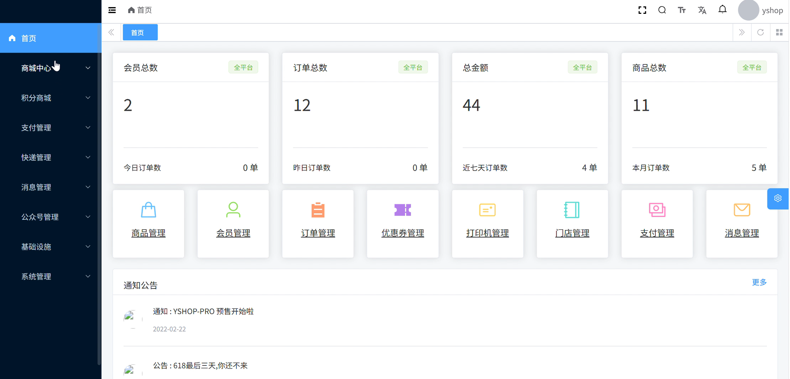
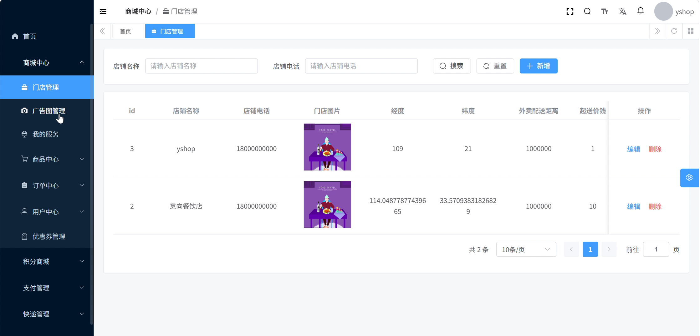
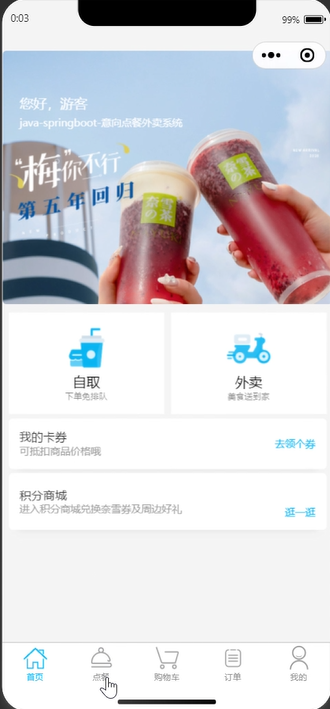
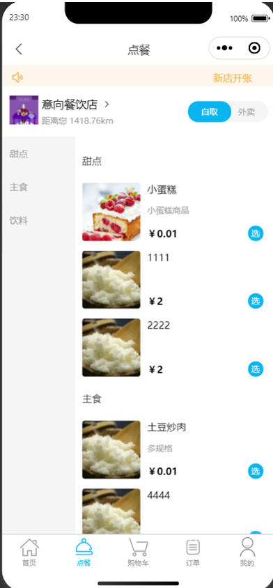
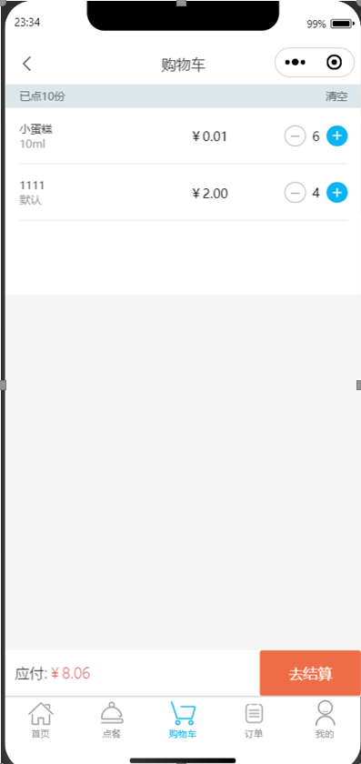
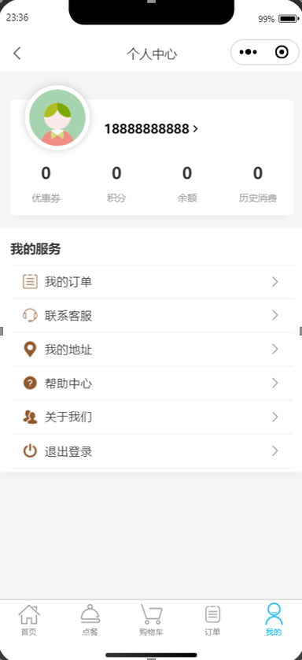

<h1 align="center">点餐系统</h1>

  <strong>基于 Spring Boot 3 + Vue 3 + uni-app 的 SaaS 多门店扫码点餐系统</strong>

  

  

  

  

  

  

文档日期： 2026年6月15日  

项目说明： 开源SaaS多门店扫码点餐系统，支持堂食/外卖/自提，集成部分微信生态

---

📋 目录

- 项目简介
- 核心功能
- 技术栈
- 系统架构
- 界面预览
- 快速开始
- 项目结构
- 开发计划

---

📖 项目简介

=======

- 多门店 SaaS 架构：一套系统支撑多租户、多门店独立运营
- 全渠道覆盖：微信小程序、H5 网页、收银端三端统一
- 堂食/外卖/自提：三种就餐模式无缝切换
- 微信生态集成：公众号模板消息、小程序登录、微信支付整合

面向中小型餐饮商户的完整数字化点餐解决方案。系统提供从顾客扫码点餐、在线支付、后厨出单到商户后台管理的全链路服务，支持堂食 / 外卖 / 自提三种就餐模式。

本项目基于开源项目重构升级，采用 Java 17 + Spring Boot 3 + Vue 3 + uni-app + Element Plus + uview-plus 等主流技术栈，代码结构清晰，适合二次开发和学习。

目标用户

  角色   	说明                    
  超级管理员	平台运营方，管理所有租户、门店和系统配置  
  门店管理员	各门店的实际运营者，管理本店商品、订单、数据
  门店员工 	收银、出餐等日常操作            
  普通顾客 	通过小程序 / H5 扫码点餐的最终消费者 

---

✨ 核心功能

🏪 门店管理

- 多门店独立运营，每个门店可独立配置营业时间、配送费、起送金额
- 支持门店信息展示、位置导航、公告发布
- 云打印集成，订单支付后自动推送打印

🛒 商品管理

- 商品分类管理，支持单规格 / 多规格（如口味、尺寸）SKU
- 商品上下架、库存管理、价格体系（售价 / 原价 / 成本价）
- 商品详情富文本编辑

📦 订单管理

- 堂食扫码点餐、外卖配送、到店自提三种模式
- 订单全生命周期管理（待支付 → 已支付 → 制作中 → 已完成）
- 拼桌 / 多人点餐：同一桌号多人独立下单、独立支付
- 订单核销、退款处理

💳 支付集成

- 微信支付（JSAPI）
- 余额支付
- 支付回调与退款处理

👥 会员管理

- 会员信息、余额、积分体系
- 收货地址管理
- 优惠券发放与核销

🏗️ 平台管理

- 多租户 SaaS 架构，租户间数据完全隔离
- RBAC 权限模型（用户 → 角色 → 菜单/权限）
- 操作日志、登录日志、API 访问日志审计
- 定时任务管理、文件存储、字典管理

---

🛠 技术栈

后端

  技术             	版本   	用途            
  Java           	17   	开发语言          
  Spring Boot    	3.2.2	微服务基础框架       
  Spring Security	6.x  	认证与授权         
  MyBatis-Plus   	3.5.x	ORM 框架        
  MySQL          	8.0  	关系数据库         
  Redis          	6+   	缓存 / 分布式锁 / 会话
  Redisson       	3.x  	分布式锁          
  RocketMQ       	-    	消息队列（可选）      
  Quartz         	2.3  	分布式任务调度       
  Knife4j        	4.x  	API 文档        
  SkyWalking     	8.x  	链路追踪          
  MinIO          	-    	对象存储          

管理后台前端

  技术          	版本  	用途     
  Vue         	3.5 	前端框架   
  TypeScript  	5.x 	类型安全   
  Vite        	5.x 	构建工具   
  Element Plus	2.11	UI 组件库 
  Pinia       	2.x 	状态管理   
  ECharts     	5.x 	数据可视化  
  UnoCSS      	-   	原子化 CSS
  Vue I18n    	9.x 	国际化    

移动端

  技术        	版本  	用途    
  uni-app   	3.x 	跨端开发框架
  Vue       	3.x 	核心框架  
  uview-plus	3.x 	UI 组件库
  Pinia     	2.x 	状态管理  

---

🏗 系统架构

整体架构分层

    ┌─────────────────────────────────────────────────────────────┐
    │                    用户接入层                                 │
    │   微信小程序    H5网页    PC管理后台    POS收银端              │
    ├─────────────────────────────────────────────────────────────┤
    │                     API 网关层                                │
    │          Spring Security OAuth2 + Knife4j                    │
    ├─────────────────────────────────────────────────────────────┤
    │                    业务服务层                                 │
    │   系统管理   商品中心   订单中心   支付中心   门店中心          │
    │   会员中心   营销中心   积分中心   公众号   消息通知           │
    ├─────────────────────────────────────────────────────────────┤
    │                    技术支撑层                                 │
    │  MyBatis-Plus · Redis · RocketMQ · Quartz · SkyWalking      │
    ├─────────────────────────────────────────────────────────────┤
    │                     数据存储层                                │
    │          MySQL 8.0           Redis 6+         MinIO          │
    └─────────────────────────────────────────────────────────────┘

后端模块架构

项目采用多模块 Maven 项目结构：

    yshop-drink-boot3/
    ├── yshop-dependencies/          # 依赖版本管理 (BOM)
    ├── yshop-framework/             # 框架基础设施 (15+ Starter 组件)
    ├── yshop-module-system/         # 系统管理模块
    ├── yshop-module-mall/           # 商城核心模块
    │   ├── product-api/biz          #   商品中心
    │   ├── order-api/biz            #   订单中心
    │   ├── shop-api/biz             #   门店中心
    │   └── store-api/biz            #   店铺配置
    ├── yshop-module-member/         # 会员模块
    ├── yshop-module-marketing/      # 营销模块
    ├── yshop-module-pay/            # 支付模块
    ├── yshop-module-score/          # 积分商城模块
    ├── yshop-module-mp/             # 微信公众号模块
    ├── yshop-module-message/        # 消息通知模块
    ├── yshop-module-express/        # 物流快递模块
    ├── yshop-module-infra/          # 基础设施模块
    └── yshop-server/                # Spring Boot 启动入口

每个业务模块拆分为 -api（接口定义）和 -biz（业务实现），实现松耦合。

---

🖥 界面预览

  
  
   
  <em>管理后台截图</em>

  
  
  
  
   
  <em>移动端截图</em>

核心业务流程

堂食点餐流程：

    顾客扫码 → 进入门店主页 → 浏览菜单 → 选规格/加购物车 → 提交订单
    → 选择支付方式（微信支付/余额支付）→ 支付成功 → 打印小票
    → 后厨接单 → 制作 → 出餐

拼桌/多人点餐：

    顾客A扫码 → 创建桌台会话
    顾客B扫码 → 加入同一桌台（WebSocket 实时同步）
        ├── 各自加菜到共享购物车
        ├── 各自提交个人订单
        └── 独立支付

---

🚀 快速开始

环境要求

  组件     	版本要求
  JDK    	17+ 
  MySQL  	8.0+
  Redis  	6+  
  Maven  	3.8+
  Node.js	16+ 
  pnpm   	8.6+

后端启动

    # 1. 克隆项目
    git clone https://github.com/your-username/yshop-drink.git
    cd yshop-drink/springboot3
    
    # 2. 导入 SQL 脚本到 MySQL
    mysql -u root -p < sql/yixiang-drink-open.sql
    
    # 3. 修改配置文件
    #    编辑 yshop-server/src/main/resources/application-local.yaml
    #    配置数据库连接、Redis 连接等信息
    
    # 4. 打包并启动
    mvn clean package -DskipTests
    java -jar yshop-server/target/yshop-server.jar --spring.profiles.active=local

管理后台启动

    cd vue3
    pnpm install
    pnpm dev

访问地址：http://localhost:5173

移动端启动

使用 HBuilderX 打开 uniapp-vue3 目录，运行到微信小程序或浏览器。

Docker 部署

项目根目录提供 Docker Compose 配置，一键启动所有依赖服务：

    docker-compose up -d

---

📁 项目结构

    yshop-drink/
    ├── README.md                          # 项目说明文档
    ├── docs/                              # 文档与图片资源
    │   └── images/                        #   图片资源目录
    │
    ├── springboot3/                       # 后端 Java 项目
    │   ├── pom.xml
    │   ├── yshop-dependencies/            #   依赖版本管理
    │   ├── yshop-framework/               #   框架基础设施
    │   ├── yshop-module-system/           #   系统管理模块
    │   ├── yshop-module-mall/             #   商城核心模块
    │   ├── yshop-module-member/           #   会员模块
    │   ├── yshop-module-marketing/        #   营销模块
    │   ├── yshop-module-pay/              #   支付模块
    │   ├── yshop-module-score/            #   积分模块
    │   ├── yshop-module-mp/               #   公众号模块
    │   ├── yshop-module-message/          #   消息模块
    │   ├── yshop-module-express/          #   物流模块
    │   ├── yshop-module-infra/            #   基础设施模块
    │   ├── yshop-server/                  #   启动入口
    │   └── sql/                           #   数据库脚本
    │
    ├── vue3/                               # PC 管理后台前端
    │   ├── src/
    │   │   ├── api/                       #   接口层
    │   │   ├── views/                     #   页面组件
    │   │   ├── router/                    #   路由
    │   │   ├── store/                     #   状态管理 (Pinia)
    │   │   ├── components/                #   公共组件
    │   │   ├── layouts/                   #   布局组件
    │   │   ├── locales/                   #   国际化 (中/英)
    │   │   ├── styles/                    #   全局样式
    │   │   └── utils/                     #   工具函数
    │   └── ...
    │
    └── uniapp-vue3/                        # 移动端前端
        ├── pages/
        │   ├── index/                     #   首页
        │   ├── menu/                      #   菜单
        │   ├── order/                     #   订单
        │   ├── cart/                      #   购物车
        │   └── mine/                      #   个人中心
        ├── api/                           #   接口层
        ├── components/                    #   组件
        ├── store/                         #   状态管理
        └── utils/                         #   工具函数

---

🗺 开发计划

- 多租户 SaaS 架构
- 商品 / 订单 / 门店 / 会员核心模块
- 微信支付集成
- PC 管理后台 + 移动端小程序
- 微信公众号菜单与模板消息
- 数据统计仪表盘增强
- 多语言国际化完善
- 性能优化与压测

